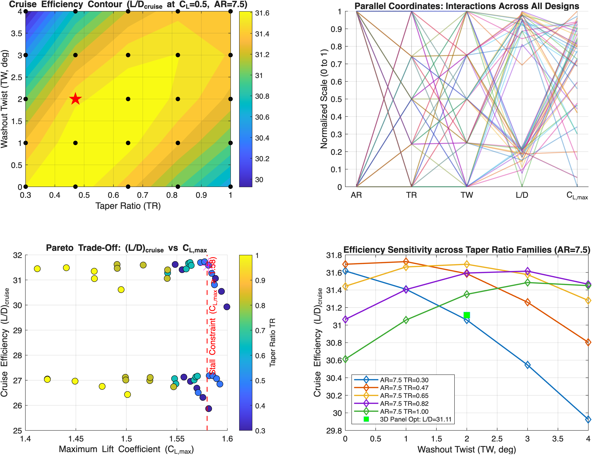

# Aerodynamic Optimization & Design Space Analysis of a NACA 2412 Cessna Wing


Automated 50-design parametric aerodynamic trade study and preliminary design optimization for a Cessna 172-class general aviation wing using **XFLR5 (VLM/LLT & 3D Panel Method)** and automated **MATLAB / Python** data extraction and visualization pipelines[cite: 1].

---

## 📌 Executive Summary

This project executes a constrained aerodynamic design optimization of a trapezoidal wing built around the **NACA 2412** airfoil[cite: 1]. A 50-design Design of Experiments (DOE) grid was evaluated across sweeps of **Aspect Ratio ($AR$)**, **Taper Ratio ($TR$)**, and **Washout Twist ($TW$)**[cite: 1].

* **Baseline Planform (`AR6.00_TR1.00_TW0.00`):** $(L/D)_{\text{cruise}} = 26.43$, $CD_i = 0.01384$, $C_{L,\max} = 1.5012$[cite: 1].
* **Optimal Planform (`AR7.50_TR0.47_TW2.00`):** $(L/D)_{\text{cruise}} = 31.59$, $CD_i = 0.01075$, $C_{L,\max} = 1.5813 \ge 1.58$[cite: 1].
* **Key Achievements:** Achieved a **$+19.51\%$ boost in cruise efficiency** ($(L/D)_{\text{cruise}}$) and a **$-22.35\%$ reduction in induced drag ($CD_i$)** over the untapered rectangular baseline while satisfying maximum lift stall thresholds ($C_{L,\max} \ge 1.58$) and pitch stability requirements ($C_{m_\alpha} < 0$)[cite: 1].

---

## 📐 Project Formulation & Constraints

### Operational & Design Parameters
* **Airfoil Profile:** NACA 2412[cite: 1]
* **Flow Conditions:** Freestream velocity $V_\infty = 25.0\text{ m/s}$ ($Re \approx 2.8 \times 10^6 - 3.0 \times 10^6$), Reference wing area $S_{\text{ref}} = 20.130\text{ m}^2$[cite: 1]
* **Target Cruise Condition:** Lift coefficient $C_{L,\text{cruise}} = 0.50$[cite: 1]

### Design Constraints
1. **Stall Capacity Constraint:** $C_{L,\max} \ge 1.58$[cite: 1]
2. **Static Longitudinal Stability:** Pitching moment slope $C_{m_\alpha} < 0\text{ deg}^{-1}$[cite: 1]

### Parametric Design Space (50 Designs)
* **Aspect Ratio ($AR$):** $\{6.00, 7.50\}$[cite: 1]
* **Taper Ratio ($TR$):** $\{0.30, 0.47, 0.65, 0.82, 1.00\}$[cite: 1]
* **Washout Twist ($TW$):** $\{0.0^\circ, 1.0^\circ, 2.0^\circ, 3.0^\circ, 4.0^\circ\}$[cite: 1]

---

## 📊 Performance Comparison Table

| Metric | Baseline Wing | Optimal Design | Performance Impact |
| :--- | :---: | :---: | :---: |
| **Design Designation** | `AR6.00_TR1.00_TW0.00` | **`AR7.50_TR0.47_TW2.00`** | Optimized Geometry[cite: 1] |
| **Aspect Ratio ($AR$)** | $6.00$ | **$7.50$** | Higher Span / Aspect Ratio[cite: 1] |
| **Taper Ratio ($TR$)** | $1.00$ (Rectangular) | **$0.47$** | Near-Elliptical Circulation[cite: 1] |
| **Washout Twist ($TW$)** | $0.0^\circ$ | **$2.0^\circ$** | Tip Stall Mitigation[cite: 1] |
| **Cruise Efficiency $(L/D)_{\text{cruise}}$** | $26.43$ | **$31.59$** | **$+19.51\%$ Increase**[cite: 1] |
| **Induced Drag Coefficient ($CD_i$)** | $0.01384$ | **$0.01075$** | **$-22.35\%$ Reduction**[cite: 1] |
| **Total Drag Coefficient ($CD$)** | $0.01893$ | **$0.01583$** | **$-16.38\%$ Drag Drop**[cite: 1] |
| **Maximum Lift ($C_{L,\max}$)** | $1.5012$ | **$1.5813$** | **Stall Constraint Satisfied**[cite: 1] |
| **Pitching Moment Slope ($C_{m_\alpha}$)** | $-0.01997\text{ deg}^{-1}$ | **$-0.02280\text{ deg}^{-1}$** | Enhanced Static Stability[cite: 1] |

---

## 📈 Visualizations & Trade Study Analysis

[cite: 1]

1. **Top-Left (Contour Map at $AR=7.50$):** Identifies the sweet spot for cruise efficiency near $TR = 0.47$ and $TW = 2.0^\circ$[cite: 1].
2. **Top-Right (Parallel Coordinates):** Illustrates the multi-variable interactions across all 50 design iterations[cite: 1].
3. **Bottom-Left (Pareto Trade-Off Curve):** Demonstrates how $2.0^\circ$ twist pushes highly efficient $TR=0.47$ designs past the $C_{L,\max} \ge 1.58$ stall line[cite: 1].
4. **Bottom-Right (Sensitivity Analysis & 3D Panel Validation):** Shows high stability against manufacturing twist tolerances and validates VLM against 3D Panel method predictions ($(L/D)_{\text{3D Panel}} = 31.11$, **$<1.5\%$ delta**)[cite: 1].

---

## 🛠️ Repository Structure & Quick Start

```text
├── polar_files/                      # Raw 50 XFLR5 export CSV polar files
├── analyze_xflr5_doe.m              # Complete MATLAB extraction & visualization script
├── generate_xflr5_trade_study.py    # Python analysis pipeline with Matplotlib/Seaborn
├── extracted_50_designs_metrics.csv # Structured dataset of computed aerodynamic metrics
├── xflr5_50_designs_trade_study.png # 4-panel trade study figure
└── README.md                        # Project documentation
